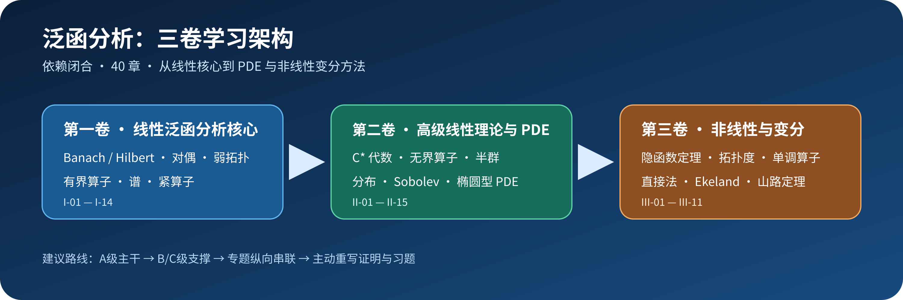

<div align="center">

<a id="top"></a>

# 泛函分析自学书

**FA-Book · v1.0.0**

三卷 · 40 章 · **577 页** · 从 Banach / Hilbert 空间到谱理论、无界算子、半群、Sobolev 空间、偏微分方程、非线性分析与变分法

<p>
  <a href="./FA-Book.pdf"></a>
  <a href="./FA-Book.tex"></a>
  <a href="https://github.com/Bluevarpi/FA-Book/releases/tag/v1.0.0"></a>
  <a href="#qa"></a>
</p>

<p>
  
  
  
  
</p>

[项目简介](#overview) · [全书结构](#structure) · [学习路线](#learning-map) · [GitHub 模块](#github) · [编译](#build) · [QA](#qa) · [文件结构](#files) · [贡献](#contributing)

</div>

---

<div align="center">
<table>
<tr>
<td width="28%" align="center" valign="top">
  
</td>
<td width="72%" align="center" valign="middle">
  
</td>
</tr>
</table>
</div>

<a id="overview"></a>
## 项目简介

FA-Book 是一套面向长期自学的泛函分析 LaTeX 教材。全书以依赖闭合为组织原则：先建立度量、完备性、Banach / Hilbert 空间与有界算子基础，再进入对偶与弱拓扑、谱理论与紧算子；第二卷扩展到局部凸空间、Banach / \(C^*\) 代数、Bochner 积分、无界算子、半群、Sobolev 空间与偏微分方程；第三卷集中处理非线性微分、拓扑度、单调算子、变分直接法、临界点与极小极大方法。

| 项目 | 内容 |
|---|---|
| 正式版本 | `v1.0.0` |
| 卷数 / 章节数 | 3 卷 / 40 章 |
| 最终 PDF | `FA-Book.pdf`，577 页 |
| 主编译入口 | `FA-Book.tex` |
| 排版 | XeLaTeX + `ctex` + CMU / Fandol 字体体系 |
| 参考文献 / 索引 | Biber + MakeIndex |
| QA 辅助 | `scripts/lint.py`、`scripts/test_lint.py` |

> 本项目使用生成式人工智能辅助完成，未经独立人类数学专家逐条审校；关键内容应结合正式教材和原始文献核验。

<a id="structure"></a>
## 全书结构

| 卷 | 章节 | 主线 |
|---|---:|---|
| **第一卷：基础、对偶与算子谱论** | I-01–I-14 | 拓扑与完备性、Banach / Hilbert 几何、Hahn--Banach、弱拓扑、Banach 原理、谱与紧算子 |
| **第二卷：高级线性理论与无界算子** | II-01–II-15 | 局部凸空间、Banach / \(C^*\) 代数、Bochner 积分、无界算子、谱定理、半群、Sobolev 与 PDE |
| **第三卷：非线性分析与变分法** | III-01–III-11 | Fréchet 微分、隐函数定理、固定点与拓扑度、单调算子、直接法、Ekeland、Palais--Smale、山路定理与高级选读 |

章节内以 A/B/C/D 四级节点表示学习优先级：A 级为主线核心，B 级为重要支撑，C 级为局部工具，D 级为高级选读或后续理论接口。

<a id="learning-map"></a>
## 学习路线

<div align="center">

</div>

| 阶段 | 目标 | 建议 |
|---|---|---|
| 第 1 遍：骨架 | 建立全局结构 | 优先读 A 级定义与主定理，先理解对象、假设和结论 |
| 第 2 遍：证明 | 闭合关键依赖 | 回到 B/C 级工具，核对完备性、紧性、定义域、拓扑与积分合法性 |
| 第 3 遍：专题 | 形成纵向链 | 按谱理论、无界算子与半群、Sobolev / PDE、非线性与变分四条主线跨章学习 |
| 第 4 遍：输出 | 主动掌握 | 重写证明、完成习题、整理定理卡片与依赖图 |

<details>
<summary><strong>算子与谱论路线</strong></summary>

`I-03 → I-04 → I-05 → I-06 → I-07 → I-10 → I-11 → I-12 → I-13 → I-14 → II-02 → II-03 → II-05 → II-06 → II-07`

</details>

<details>
<summary><strong>半群、Sobolev 与 PDE 路线</strong></summary>

`I-03 / I-04 / I-07 / I-10 → II-04 → II-05 → II-08 → II-09 → II-10 → II-11 → II-12 → II-13 → II-14 → II-15`

</details>

<details>
<summary><strong>非线性与变分路线</strong></summary>

`I-03 / I-04 / I-06 / I-07 / I-10 → III-01 → III-02 → III-03 → III-04 → III-05 → III-06 → III-07 → III-08 → III-09 → III-10 → III-11`

</details>

<a id="github"></a>
## GitHub 模块

<div align="center">

<a href="https://github.com/Bluevarpi/FA-Book/releases/tag/v1.0.0"></a>
<a href="https://github.com/Bluevarpi/FA-Book/commits"></a>
<a href="https://github.com/Bluevarpi/FA-Book/stargazers"></a>
<a href="https://github.com/Bluevarpi/FA-Book/forks"></a>
<a href="https://github.com/Bluevarpi/FA-Book/issues?q=is%3Aissue+is%3Aclosed"></a>
<a href="https://github.com/Bluevarpi/FA-Book/pulls?q=is%3Apr+is%3Aclosed"></a>
<a href="https://github.com/Bluevarpi/FA-Book/graphs/contributors"></a>
<a href="https://github.com/Bluevarpi/FA-Book/discussions"></a>
<a href="https://github.com/Bluevarpi/FA-Book/commits"></a>

</div>

- 正式仓库：<https://github.com/Bluevarpi/FA-Book>
- v1.0.0 Release：<https://github.com/Bluevarpi/FA-Book/releases/tag/v1.0.0>
- PDF 入口：[`FA-Book.pdf`](./FA-Book.pdf)
- TeX 入口：[`FA-Book.tex`](./FA-Book.tex)

<a id="build"></a>
## 编译

### 推荐方式：latexmk

```bash
latexmk -xelatex -interaction=nonstopmode -halt-on-error FA-Book.tex
```

项目的 `.latexmkrc` 已按 XeLaTeX 工作流配置。完整构建需要 XeLaTeX、Biber 与 MakeIndex。

### 手动完整构建链

```bash
xelatex -interaction=nonstopmode -halt-on-error FA-Book.tex
biber FA-Book
makeindex FA-Book.idx
xelatex -interaction=nonstopmode -halt-on-error FA-Book.tex
xelatex -interaction=nonstopmode -halt-on-error FA-Book.tex
```

### 主要依赖

- TeX Live，包含 `ctex`、`fontspec`、`tikz`、`tcolorbox`、`biblatex`、`hyperref` 等宏包。
- 拉丁字体使用 CMU Serif / Sans / Typewriter；中文字体使用 TeX Live / 系统可用的 Fandol 字体。项目 ZIP **不包含字体文件**。
- 参考文献使用 Biber，术语索引使用 MakeIndex。

### 本地 QA

```bash
python3 scripts/test_lint.py
python3 scripts/lint.py .
```

Python 文件仅用于 lint / QA 辅助，不参与教材正文生成。

<a id="qa"></a>
## 最终 QA

| 项目 | v1.0.0 结果 |
|---|---:|
| PDF 页数 | 577 |
| 全页渲染 | 577/577 PASS |
| Overfull | 0 |
| Undefined references | 0 |
| Undefined citations | 0 |
| lint 单元测试 | PASS |
| HARD lint findings | 0 |
| Biber | PASS |
| MakeIndex | PASS |

QA 用于验证构建、交叉引用、机械规范与最终排版，不等同于独立的数学同行评审。

<a id="files"></a>
## 文件结构

```text
FA-Book/
├── FA-Book.tex
├── FA-Book.pdf
├── README.md
├── .latexmkrc
├── chapters/
│   ├── I-01.tex ... I-14.tex
│   ├── II-01.tex ... II-15.tex
│   └── III-01.tex ... III-11.tex
├── frontmatter/
│   ├── titlepage.tex
│   ├── ai-declaration.tex
│   ├── reader-guide.tex
│   └── preface-*.tex
├── style/
│   └── fa-book.sty
├── references/
│   └── references.bib
├── assets/
│   └── readme/
│       ├── cover.png
│       ├── architecture.png
│       ├── architecture.svg
│       ├── pipeline.png
│       └── pipeline.svg
└── scripts/
    ├── lint.py
    └── test_lint.py
```

<a id="contributing"></a>
## 贡献

欢迎提交可核验、边界清晰的局部修正，包括：

- 数学错误、证明缺口或假设遗漏；
- 定义域、拓扑、指数范围、弱/强收敛等语义问题；
- LaTeX 编译、交叉引用、索引或目录问题；
- 可复现的排版与视觉问题；
- 参考文献元数据修正。

<div align="center">

<a href="https://github.com/Bluevarpi/FA-Book/issues"></a>
<a href="https://github.com/Bluevarpi/FA-Book/pulls"></a>

<br><br>
<a href="#top"><strong>返回顶部</strong></a>

</div>
